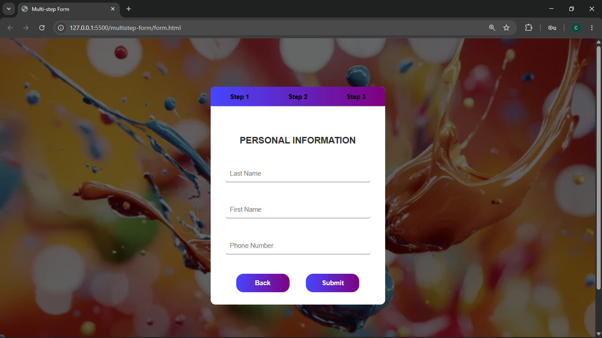

# Frequently Asked Questions

## Description
A Multi step form with input fields to collect details from user, with buttons labelled next and back to navigate between the 'create account', 'social media handles' and 'personal information' forms. Built using HTML, CSS, and JavaScript.

## Features
- Three forms to collect different typesof information from user
- Each field is required to be filled before proceeding to the next form
- Buttons labelled 'Next' to proceed to the next step in the form and 'Back' to return to the previous step in the form
- A progress bar showing progress along the form once the 'Next' button is being clicked on
- A 'Submit' button at the end of the form 

## How to Run
1. Clone the repository
2. Open form.html in your browser

## Tech Stack
- HTML
- CSS
- JavaScript

